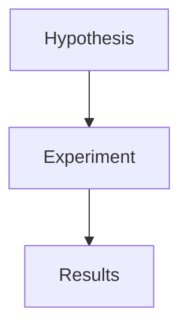

# mdpp

mdpp is a single-package, plain-text document system for technical and science-flavored writing.

It keeps Markdown ergonomics while adding structured document features: math, footnotes, admonitions, emoji shortcodes, diagram fences, frontmatter, tables, headings, syntax-highlighted code, and a real AST backed by gotreesitter.

```go
doc := mdpp.Parse([]byte(source))
html := mdpp.RenderString(source)
```

Diagram fences are parsed as document structure and rendered safely by default:

````md

````

The long-term shape is still one Go package: parser, renderer, diagnostics, formatting, and language-service APIs under `package mdpp`.
