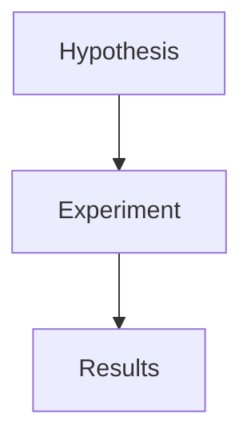

# Markdown++

The only Markdown stack with a real grammar: the LSP, formatter, and linter understand your document instead of pattern-matching at it, and the output is a faithful artifact rather than a best-effort guess.

Markdown++ keeps `.md` files readable everywhere while adding the authoring tools Markdown has always needed: diagnostics, formatting, semantic highlighting, hover, completions, live preview, HTML rendering, and PDF export. The core is a Go package backed by gotreesitter, so every tool works from the same syntax tree with byte ranges.

## Install

For authors, start with the VS Code extension:

```text
VSIX release: https://github.com/odvcencio/mdpp-vscode/releases/tag/v0.1.10
Marketplace item: m31labs.markdown-plus-plus
```

Extension source lives at <https://github.com/odvcencio/mdpp-vscode>.

For the CLI and language server:

```bash
go install github.com/odvcencio/mdpp/cmd/mdpp@latest
go install github.com/odvcencio/mdpp/cmd/mdpp-lsp@latest
```

Pre-built binaries are published on GitHub Releases for macOS, Linux, and Windows.

## CLI

Render HTML:

```bash
mdpp render README.md -o README.html
```

Export PDF:

```bash
mdpp render --format=pdf README.md -o README.pdf
```

Format and lint:

```bash
mdpp fmt --check README.md
mdpp lint README.md
```

Parse to JSON:

```bash
mdpp parse --json README.md
```

## Go API

```go
doc := mdpp.Parse([]byte(source))
html := mdpp.RenderString(source)
```

The package exposes the parser, renderer, diagnostics, formatter, linter inputs, table of contents, frontmatter, and source ranges under one module:

```bash
go get github.com/odvcencio/mdpp
```

## What Ships

| Area | Support |
| --- | --- |
| Markdown compatibility | CommonMark-style Markdown plus GFM tables, task lists, autolinks, and strikethrough. |
| Structured extensions | Math, footnotes, admonitions, emoji shortcodes, diagram fences, frontmatter, `[[toc]]`, and `[[embed:url]]`. |
| Formatter | Source-preserving canonical formatting for headings, lists, tables, directives, fences, references, and footnotes. |
| Linter | Built-in Markdown++ rules with source ranges, fixes, and LSP diagnostics. |
| LSP | Hover, definition, document symbols, formatting, completions, semantic tokens, code actions, and live-preview rendering. |
| Output | HTML and PDF. |

## Why It Is Different

Most Markdown tooling can recognize shapes. Markdown++ works with syntax nodes.

That matters when a document contains nested lists, code fences, math, HTML, footnotes, diagrams, and links that all reuse the same punctuation. A regex can find `[ref]`; a parsed document can tell whether it is link text, a reference label, a footnote, code, escaped text, or an HTML attribute.

That is what makes these features practical:

- Rename or navigate headings, footnotes, and references without touching lookalikes in code blocks.
- Format source while preserving code, math, HTML, YAML values, and diagram bodies byte-for-byte.
- Highlight meaning, not just punctuation.
- Render a live preview from the same AST used by diagnostics and formatting.
- Export HTML and PDF from the same document model.

## Example

````md
# Research Notes

[[toc]]

> [!TIP] Keep the source plain. Let the tools handle structure.



See [the appendix][appendix] and note[^1].

[^1]: Footnotes are part of the AST.

[appendix]: https://example.com
````

Diagram fences are parsed as document structure and rendered safely by default.

## License

MIT
