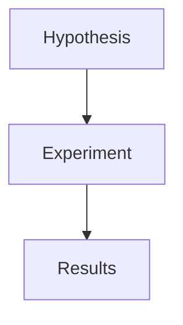

# Markdown++

The only Markdown stack with a real grammar: the LSP, formatter, and linter understand your document instead of pattern-matching at it, and the output is a faithful artifact rather than a best-effort guess.

Markdown++ keeps `.md` files readable everywhere while adding the authoring tools Markdown has always needed: diagnostics, formatting, semantic highlighting, hover, completions, live preview, HTML rendering, and optional PDF export. The core is a Go package backed by gotreesitter, so every tool works from the same syntax tree with byte ranges.

## Agent Skill

Agents helping someone use mdpp should read the canonical M31 Labs skill: [using-mdpp](https://github.com/odvcencio/m31labs-skills/blob/main/skills/using-mdpp/SKILL.md).

## Install

For authors, start with the VS Code extension:

```text
VSIX release: https://github.com/odvcencio/mdpp-vscode/releases/tag/v0.1.10
Marketplace item: m31labs.markdown-plus-plus
```

Extension source lives in [mdpp-vscode](https://github.com/odvcencio/mdpp-vscode).

For the CLI and language server:

```bash
go install m31labs.dev/mdpp/cmd/mdpp@latest
go install m31labs.dev/mdpp/cmd/mdpp-lsp@latest
```

Pre-built binaries are published on GitHub Releases for macOS, Linux, and Windows.

## CLI

Render HTML:

```bash
mdpp render README.md -o README.html
```

Format to stdout, update a file, or use the formatter and linter as CI gates:

```bash
mdpp fmt README.md > README.formatted.md
mdpp fmt --write README.md
mdpp fmt --check README.md
mdpp lint README.md
```

Plain `mdpp fmt` is a source-to-source filter: it always writes one complete
formatted document for every input, including input that is already canonical.
`--write` (or `-w`), `--check`, and `--diff` are mutually exclusive. Formatter
and linter checks return `0` when clean, `1` when they report findings, and `2`
for invalid usage or an I/O/processing error.

Parse to JSON:

```bash
mdpp parse --json README.md
```

## Go API

```go
doc, err := mdpp.Parse([]byte(source))
if err != nil {
    return err
}
html, err := mdpp.Render(doc, mdpp.RenderOptions{})
if err != nil {
    return err
}
```

`Parse` uses a deterministic work budget of 256 parser-work units per input
byte, with a 64,000-unit floor. Its wall-clock deadline starts at 20 seconds
and adds 10 seconds per MiB. The deadline is a backstop for real runaways. Pass
tighter values with `ParseOptions`, or pass a context with an earlier deadline:

```go
doc, err := mdpp.ParseWithOptions([]byte(source), mdpp.ParseOptions{
    WorkBudget: 1_000_000,
    Deadline:   3 * time.Second,
})
```

Import `time` when setting `Deadline`. To use a caller-owned deadline or
cancellation signal, pass its context to `ParseContext`:

```go
ctx, cancel := context.WithTimeout(context.Background(), 3*time.Second)
defer cancel()
doc, err := mdpp.ParseContext(ctx, []byte(source))
```

Import `context` and `time` for this example.

When a work, memory, or deadline limit is reached, the returned document
contains the complete source as text and an `MDPP-PARSE-005` warning that names
the limit. A zero option selects its default.

The package exposes the parser, renderer, diagnostics, formatter, linter inputs, table of contents, frontmatter, and source ranges under one module:

```bash
go get m31labs.dev/mdpp
```

PDF rendering is intentionally split into an optional module so HTML-only
consumers do not pay for browser dependencies:

```bash
go get m31labs.dev/mdpp/pdf
```

```go
doc := mdpp.MustParse([]byte(source))
out, err := pdf.Render(doc, pdf.Options{
    RenderOptions: mdpp.RenderOptions{HeadingIDs: true},
})
```

## Rendering safety

`RenderOptions` has three trust modes:

- **Safe (default):** raw HTML is escaped. URLs using `javascript:`, `vbscript:`,
  `file:`, or disallowed `data:` media types get an empty `href` or `src`.
  Data URLs are allowed only for PNG, GIF, JPEG, WebP, and AVIF image sources.
  Relative URLs, fragments, and other schemes pass through unchanged.
- **Sanitized:** set `Sanitize: true` to apply the URL policy and an HTML
  allow-list. If `UnsafeHTML` is also true, allowed formatting HTML is kept,
  event-handler attributes are removed, and dangerous elements are dropped.
  The sanitizer also applies GFM's raw HTML tag filter.
- **Trusted:** set `UnsafeHTML: true` and leave `Sanitize` false only for
  trusted-author content. Raw HTML and URLs pass through unchanged.

`URLPolicy` can reject or rewrite URLs after the built-in policy. It can make
the policy stricter, but cannot re-enable a blocked scheme.

## Story authoring

The LSP understands authored slide IDs and named cues in parsed YAML fences,
`cue`/`after` motion attributes, local `#slide/cue` links, and actor declarations
and edge endpoints inside Sirena fences. Definition, references and rename use
exact byte ranges; actor names stay scoped to their diagram. Unknown references
and duplicate slide IDs produce diagnostics before presentation.
YAML comments are excluded. Plain and quoted scalar names, comma-separated cues,
and cue lists retain exact edit ranges, including UTF-8 and escaped names.
Aliases, folded/literal scalars and noncontiguous spellings without safe ranges
remain unindexed.

The core API is `IndexStory(doc)`. Its symbols expose kind, scope, declaration
status and source range against normalized `Document.Source`, matching the AST.
Read-only indexing, references and diagnostics support LF, CRLF, CR and mixed
line endings, including after slide splitting. The LSP maps story ranges to
the editor's original source and UTF-16 positions. `Rename` rejects ambiguous
declarations and collisions.
`EditDirectiveAttributes(doc, openingByte, changes)` edits parsed directive
openings while retaining spacing, quote style, other attributes and the body.
Both APIs keep the core free of a Sirena dependency. Diagram semantic validation
still belongs to the supplied Sirena renderer. Source edits currently require LF
input; `Rename`, `EditDirectiveAttributes` and LSP story rename reject input
containing carriage returns rather than apply normalized offsets to original bytes.

## What Ships

| Area | Support |
| --- | --- |
| Markdown compatibility | CommonMark-style Markdown plus GFM tables, task lists, autolinks, and strikethrough. |
| Structured extensions | Math, footnotes, admonitions, emoji shortcodes, diagram fences, frontmatter, `[[toc]]`, and `[[embed:url]]`. |
| Formatter | Source-preserving canonical formatting for headings, lists, tables, directives, fences, references, and footnotes. |
| Linter | Built-in Markdown++ rules with source ranges, fixes, and LSP diagnostics. |
| LSP | Hover, definition, document symbols, formatting, completions, semantic tokens, code actions, and live-preview rendering. |
| Output | HTML in core; PDF in `m31labs.dev/mdpp/pdf`. |

## Why It Is Different

Most Markdown tooling can recognize shapes. Markdown++ works with syntax nodes.

That matters when a document contains nested lists, code fences, math, HTML, footnotes, diagrams, and links that all reuse the same punctuation. A regex can find `[ref]`; a parsed document can tell whether it is link text, a reference label, a footnote, code, escaped text, or an HTML attribute.

That is what makes these features practical:

- Rename or navigate headings, footnotes, and references without touching lookalikes in code blocks.
- Format source while preserving code, math, HTML, YAML values, and diagram bodies byte-for-byte.
- Highlight meaning, not just punctuation.
- Render a live preview from the same AST used by diagnostics and formatting.
- Export HTML from core and PDF through the optional PDF module from the same document model.

## Example

````md
# Research Notes

[[toc]]

> [!TIP] Keep the source plain. Let the tools handle structure.


```mermaid
flowchart TD
  Hypothesis --> Experiment
  Experiment --> Results
```

See [the appendix][appendix] and note[^1].

[^1]: Footnotes are part of the AST.

[appendix]: https://example.com
````

Diagram fences are parsed as document structure and rendered safely by default.

## License

MIT
